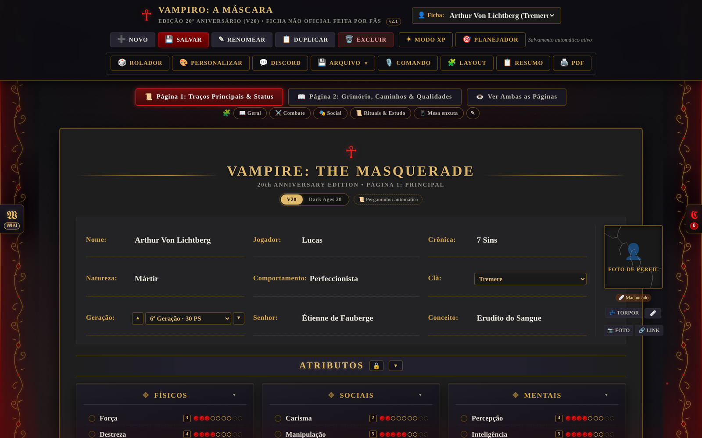
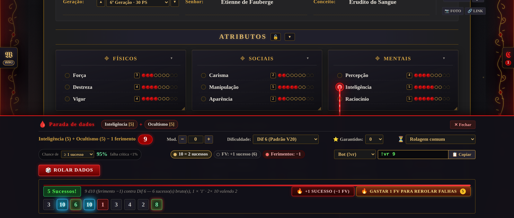
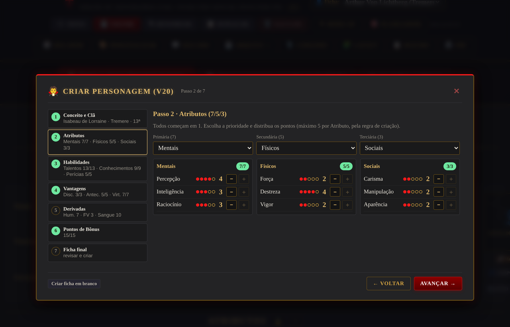
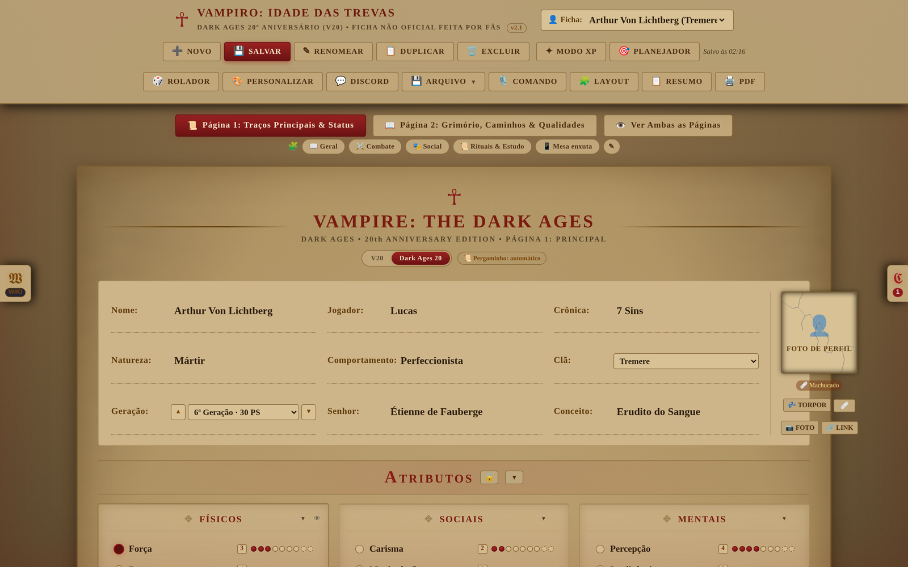

# Ficha V20 — Vampiro: A Máscara

Ficha de personagem digital para **Vampiro: A Máscara — Edição de 20º Aniversário**, feita para usar na mesa: as regras são calculadas sozinhas, os dados rolam dentro da própria ficha e tudo funciona offline, no computador ou no celular.


[](https://github.com/tanyavonhart/ficha-v20/actions/workflows/ci.yml)
[](https://github.com/tanyavonhart/ficha-v20/actions/workflows/pages.yml)




---

## Índice

- [O que é](#o-que-é)
- [Como usar](#como-usar)
- [O que a ficha faz](#o-que-a-ficha-faz)
  - [Rolador de dados](#-rolador-de-dados)
  - [Combate](#-combate)
  - [Sangue e Disciplinas físicas](#-sangue-e-disciplinas-físicas)
  - [Experiência e evolução](#-experiência-e-evolução)
  - [Grimório](#-grimório)
  - [Criação de personagem](#-criação-de-personagem)
  - [Tempo, descanso e cura](#-tempo-descanso-e-cura)
  - [Imersão: som e animações](#-imersão-som-e-animações)
  - [Aparência e layout](#-aparência-e-layout)
  - [Modo Dark Ages](#-modo-dark-ages)
  - [Rolar por comando e Siri](#-rolar-por-comando-e-siri)
  - [Discord](#-discord)
  - [Impressão e exportação](#-impressão-e-exportação)
- [Sincronizar entre aparelhos](#sincronizar-entre-aparelhos)
- [Publicar no Netlify](#publicar-no-netlify)
- [Estrutura dos arquivos](#estrutura-dos-arquivos)
- [Atalhos](#atalhos)
- [Privacidade](#privacidade)
- [Aviso legal](#aviso-legal)

---

## O que é

Uma página só, em HTML, CSS e JavaScript puro — **sem framework, sem build, sem conta**. Abra o `index.html` e a ficha funciona. Tudo o que você escrever fica guardado no próprio aparelho.

A ideia é tirar a conta da cabeça do jogador: a Geração define a reserva de sangue e o gasto por turno, os ferimentos descontam dados sozinhos, o XP cobra o valor certo pela tabela do livro e as Disciplinas entram nas paradas onde deveriam entrar.

## Como usar

**Online:** [ficha-v20.netlify.app](https://ficha-v20.netlify.app)

**No seu computador:** baixe o repositório e abra o `index.html`. Não precisa de servidor.

**Como aplicativo (iPhone, iPad, Android, desktop):** abra o site, use *Compartilhar → Adicionar à Tela de Início* (iOS) ou *Instalar* (Chrome/Edge). A ficha abre em tela cheia, com ícone próprio, e **funciona sem internet**.

---

## O que a ficha faz

### 🎲 Rolador de dados

- **Cabos:** clique nos círculos ao lado dos traços para montar a parada (Atributo + Habilidade + Disciplina + o que quiser).
- **Regras do V20 automáticas:** 10 vale 2 sucessos (pode desligar), cada **1** cancela um sucesso, falha crítica e dificuldade de 2 a 10.
- **Ferimentos** descontam dados sozinhos; dá para desligar na hora.
- **Força de Vontade:** +1 sucesso automático ou rerrolar as falhas, com o gasto já registrado.
- **Chance antes de rolar:** a ficha calcula a probabilidade exata de sucesso, com o número de sucessos que você precisa, e o risco de falha crítica. O cálculo foi conferido contra 200 mil rolagens simuladas.
- **Ações prolongadas:** somam sucessos de várias rolagens até uma meta, com histórico; falha crítica zera o progresso.
- **Histórico** de todas as rolagens, com a parada, os dados e o resultado.



### ⚔️ Combate

- **Arsenal de armas** com ataque, dificuldade, dano e tipo de dano. Sucessos extras do ataque viram dados de dano.
- **Iniciativa configurável:** quantos d10, quais traços somam, bônus fixo e se desconta ferimentos.
- **Assistente de dano recebido:** você digita o dano do inimigo, a ficha absorve, divide o contusivo pela metade, marca a Vitalidade e ainda oferece gastar sangue para curar o que sobrou.
- **Absorção** com Vigor + Fortitude (só Fortitude no agravado).

### 🩸 Sangue e Disciplinas físicas

- **Reserva pela Geração:** a 13ª tem 10 pontos e gasta 1 por turno; a 6ª tem 30 e gasta 6, e assim por diante.
- **Controle do sangue:** arraste sobre os pontos, arraste a barra, use Shift+clique para marcar intervalos ou digite a quantidade.
- **Potência e Fortitude:** 1 ponto de sangue transforma a Disciplina inteira em **sucessos automáticos pelo turno**. Com Potência 3 e Força 3 + Briga 2, você rola 5 dados já com 3 sucessos.
- **Celeridade:** 1 ponto por ação extra, cada uma tirando 1 dado de Celeridade até o fim do turno, sem respeitar o limite da Geração.
- **Potência e Celeridade** também somam dados em toda rolagem de Força e de Destreza.

### ✦ Experiência e evolução

- **Modo Editável XP:** subir um ponto cobra o valor certo pela tabela do V20, com estorno ao reduzir e histórico completo.
- **Objetivos de build:** marque metas tocando nos pontos da ficha, ordene por prioridade e deixe a compra automática ao ganhar XP.
- **Diário de sessões:** data na crônica, anotações e XP ganho, que entra sozinho no histórico.
- **Barra dourada** mostrando quanto do XP já foi gasto.

### 📜 Grimório

Três abas — **Rituais**, **Feitiços** e **Poderes de Disciplina** — cada item com parada, dificuldade (automática pelo nível ou fixa), custo em sangue e Força de Vontade, efeito e descrição. O custo é descontado na hora da rolagem.

**Caminhos** têm sugestões filtradas pela sua magia de sangue: com Taumaturgia aparecem as 23 trilhas dela, com Necromancia as 13 dela, e ainda há Feitiçaria Koldúnica, Assamita, Akhu e Mortis.

### 🧛 Criação de personagem

Assistente em 7 passos seguindo as regras do livro:

| Passo | O que faz |
|---|---|
| 1 | Conceito, clã (com Disciplinas e Fraqueza), Geração livre e edição |
| 2 | Atributos 7/5/3 |
| 3 | Habilidades 13/9/5 |
| 4 | 3 Disciplinas + 5 Antecedentes (ou 4 Disciplinas sem Antecedentes) e 7 Virtudes |
| 5 | Humanidade, Força de Vontade e sangue calculados |
| 6 | 15 Pontos de Bônus + até 7 de Defeitos, com catálogo de 256 Qualidades e Defeitos |
| 7 | Relatório com toda a matemática e criação da ficha |

Há **montagem automática pelo foco** ("investigação e combate à distância") e a opção de usar o limite da Geração em vez do limite de criação.



### 🕯️ Tempo, descanso e cura

- **Relógio da crônica** com data, hora e contagem para o amanhecer (calendário juliano antes de 1582).
- **🛌 Dormir:** recupera 1 Força de Vontade, avança a cura de um agravado e leva à próxima noite.
- **🌙 Despertar:** gasta o ponto de sangue do anoitecer e renova turno e cena.
- **Cura de agravados em fila:** 5 pontos de sangue e um dia de descanso por nível.
- **Cicatrizes:** cada agravado curado deixa uma marca no retrato, com data e a história que você escrever.

### 🔥 Imersão: som e animações

- **Trilha ambiente** gerada pelo navegador ou com o som de lareira incluído; chuva na janela e sino distante também. Começa em silêncio, por escolha.
- **Sons de ação:** dados rolando, sangue entrando e saindo, absorção, cura, magia, garras e lâminas, tambores no novo turno, tique-taque do relógio, frenesi e Rötschreck.
- **A interface reage:** esfria e ganha veios vermelhos conforme a fome, vinheta pulsando como batimento no dano agravado, tela em cinza no torpor, luz do sol ao amanhecer.
- **Animações:** pontos que se enchem como gota, Vontade que estilhaça, escudo que trinca na absorção, glifos na Taumaturgia, rastro na Celeridade, pergaminho que desenrola no Grimório.

Tudo desligável em **Efeitos leves**, **Efeitos imersivos** e **Sons de ação**.

### 🧩 Aparência e layout

- **Temas** por clã, além do **pergaminho**, que liga sozinho no Dark Ages.
- **Layout por personagem:** minimize ou oculte qualquer quadro e seção.
- **Layouts prontos:** Geral, Combate, Social, Rituais & Estudo e Mesa enxuta, trocáveis com um toque.
- **Janelas arrastáveis** no computador e **trava de edição** por seção.



### 🏰 Modo Dark Ages

Um botão troca a ficha para **Dark Ages 20**: as Habilidades ficam medievais (Arquearia, Cavalgar, Comércio, Prestidigitação, Enigmas, Senescal, Sabedoria Popular, Teologia), a Humanidade vira **Estrada** e o tema pergaminho entra em cena. Os pontos continuam nos mesmos lugares.

### 🎙️ Rolar por comando e Siri

Escreva ou fale o que rolar:

```
inteligência + ocultismo dificuldade 7
força de vontade dificuldade 5
destreza e briga mais 2 dados
atacar com soco   ·   dano mordida
ritual defesa do refúgio
absorver 4 de dano letal
```

Funciona também em inglês e com erros de digitação. Links como `?rolar=iniciativa` permitem montar um atalho da Siri (o passo a passo está dentro da ficha).

### 💬 Discord

Configure o webhook e cada rolagem vira um card no canal, com a parada, os dados, o resultado e as notas (custo do feitiço, sucessos comprados com sangue, rerrolagem com Força de Vontade).

### 🖨️ Impressão e exportação

- **PDF em duas páginas A4**, com o layout clássico da ficha.
- **Exportar/Importar** em `.json`, **backup de todas as fichas** em um arquivo e **Resumo para o Narrador** em texto.

---

## Sincronizar entre aparelhos

Em **💾 Arquivo → ☁️ Sincronizar**, cada aparelho ganha um **código** e um **PIN**. Use os mesmos nos dois: envie de um lado, baixe do outro.

- Ao baixar, as fichas se juntam pelo identificador: a mais recente vence e as novas entram sem apagar as suas.
- Opção de envio automático alguns segundos depois de cada mudança.
- O PIN é guardado apenas como hash; quem tiver código e PIN vê as fichas, então trate-os como senha.
- Limite de 3 MB por espaço.

> A sincronização usa uma função serverless com **Netlify Blobs** e só existe se o site for publicado com build (veja abaixo). Sem ela, a ficha funciona normalmente e apenas avisa que o serviço não está no ar.

## Publicar

Passo a passo completo — GitHub, GitHub Pages e Netlify — em **[docs/PUBLICAR.md](docs/PUBLICAR.md)**.


### GitHub Pages (um clique, sem sincronização)

O repositório já traz o fluxo `.github/workflows/pages.yml`. Em **Settings → Pages → Source**, escolha **GitHub Actions**. A cada `push` na `main` o site é publicado em `https://tanyavonhart.github.io/ficha-v20/`.

### Netlify

**Com sincronização** (recomendado): conecte este repositório no Netlify, ou rode

```bash
npm install
netlify deploy --build --prod
```

O `netlify.toml` já aponta a pasta das funções e o `package.json` traz o `@netlify/blobs`.

**Sem sincronização:** arraste a pasta no painel do Netlify (*Deploys → arraste aqui*). Todo o resto funciona igual.

## Estrutura dos arquivos

```
.github/workflows/          Verificação automática e publicação no GitHub Pages
docs/PUBLICAR.md            Passo a passo de GitHub, Pages e Netlify
scripts/check-version.mjs   Confere se a versão está igual em todos os arquivos
index.html                  Estrutura da ficha, janelas e modais
styles.css                  Tema gótico, pergaminho, impressão e responsivo
app.js                      Estado, personagens, dados, cabos e renderização
v20-automacoes.js           Regras do V20, XP, grimório, assistente, imersão, sync
qualidades-defeitos-data.js Catálogo com 256 Qualidades e Defeitos
service-worker.js           Cache e uso offline
manifest.webmanifest        Instalação como aplicativo
audio-lareira.m4a/.ogg      Trilha de lareira em laço (2 min)
netlify/functions/sync.mjs  Função de sincronização (Netlify Blobs)
icons/                      Ícones do app
```

## Atalhos

| Atalho | Ação |
|---|---|
| `Ctrl/⌘ + Z` | Desfazer |
| `Ctrl/⌘ + Y` ou `Ctrl/⌘ + Shift + Z` | Refazer |
| `Ctrl/⌘ + S` | Salvar |
| Setas nos pontos | Subir e descer o traço |
| `Esc` | Fechar a janela aberta |

## Privacidade

Tudo fica no seu aparelho, no armazenamento do navegador. Nada é enviado para lugar nenhum, com três exceções que você liga por conta própria: o **webhook do Discord**, a **sincronização** e as fontes do Google carregadas na primeira abertura.

## Aviso legal

Projeto **não oficial, feito por fãs e sem fins lucrativos**. *Vampire: The Masquerade* e *Vampiro: A Máscara* são marcas da **White Wolf Publishing / Paradox Interactive**. Nenhum texto de regra protegido é reproduzido aqui: a ficha apenas calcula o que o jogador digita.

O código é distribuído sob a licença MIT (veja `LICENSE`).
